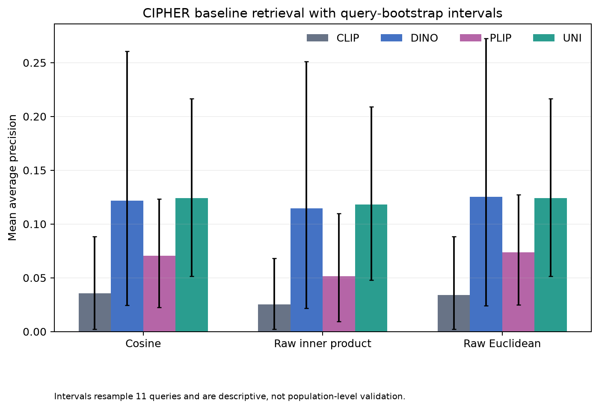

# CIPHER

**Content-based Image Pathology: Histology Embedding Retrieval**

[](https://github.com/MohammedAlTal/CIPHER/actions/workflows/ci.yml)

CIPHER is a standalone research codebase for evaluating whether embeddings from pre-trained vision and pathology models retrieve biologically relevant histopathology images. Its central concern is expert-relevant retrieval, not generic visual resemblance.

The model comparison covers CLIP, DINO, PLIP, and UNI. The current implementation establishes the dataset and ground-truth layer, a shared model runtime, content-addressed embeddings, exact retrieval, and deterministic evaluation against curated judgments.

## Status

Implemented:

- clean Python package and `cipher` terminal command;
- licensed-data separation and artifact ignore rules;
- ARCH PubMed data preparation;
- image validation and content hashing;
- 11-query benchmark mapping;
- curated-match adjudication and relevance-manifest generation;
- strict, immutable model configuration and CPU/CUDA/MPS device selection;
- pinned CLIP, original DINO ViT-B/16, and PLIP image encoders;
- pinned gated UNI ViT-L/16 adapter and access diagnostic;
- explicit projected-feature versus CLS-token output contracts;
- batched raw and L2-normalized embedding artifacts with integrity checks;
- real 11-query smoke validation for all four model adapters;
- full active-dataset embeddings for all four models;
- verified four-model row alignment and embedding-set provenance;
- exact cosine, normalized-Euclidean, raw-inner-product, and raw-Euclidean retrieval;
- full deterministic rankings with explicit self-exclusion and stable tie handling;
- macro retrieval metrics at configured cutoffs plus full MAP and MRR;
- a validated 16-combination baseline over all four models and metrics;
- paired query-bootstrap uncertainty and cross-model agreement diagnostics;
- embedding-norm and raw-versus-normalized metric sensitivity analysis;
- full grayscale and center-square preprocessing ablations for every model;
- reproducible scientific figures and quantitative result snapshots;
- an unofficial working manuscript with explicit limitations and non-endorsement;
- synthetic unit and CLI tests.

Not yet implemented:

- expert-populated explanatory annotations and expanded relevance judgments.

The baseline is descriptive because it contains only 11 queries. It must not be interpreted as a general model ranking or clinical-validity claim.

## Quick start

```bash
python3 -m venv .venv
source .venv/bin/activate
python -m pip install -r requirements.lock
python -m pip install -e . --no-deps

cipher data prepare
cipher data inspect
cipher ground-truth validate
cipher models inspect --model clip
cipher models inspect --model dino
cipher models inspect --model plip
cipher models inspect --model uni
cipher models access --model uni

for model in clip dino plip uni; do
  cipher embeddings generate --model "$model" --role query
done

for model in clip dino plip uni; do
  cipher embeddings generate --model "$model" --role all
done

cipher embeddings assemble --models clip,dino,plip,uni --role all

EMBEDDING_SET_ID="<set-id printed above>"
cipher evaluate benchmark --embedding-set "$EMBEDDING_SET_ID"

BENCHMARK_ID="<benchmark-id printed above>"
cipher analysis run --benchmark-id "$BENCHMARK_ID"

ANALYSIS_ID="<analysis-id printed above>"
cipher make-figures --analysis-id "$ANALYSIS_ID" \
  --benchmark-id "$BENCHMARK_ID"
cipher build-paper --analysis-id "$ANALYSIS_ID"
```

UNI requires each researcher to accept the upstream terms and authenticate locally. Run `hf auth login` with a read-only token; never place a token in a config file, command argument, notebook, commit, issue, or chat message. CIPHER reads the credential through the standard Hugging Face credential store and never writes it into an artifact. After the pinned files are cached, `hf auth logout` removes the local credential while CIPHER can continue using that exact cached revision.

The default preparation command downloads the official ARCH PubMed archive and imports the locally supplied curated match folder from `../matches`. Both locations can be overridden from the command line.

`requirements.lock` records the exact macOS arm64 environment validated through all four model-adapter stages. Model weights are downloaded to the upstream Hugging Face cache and are never committed. See [docs/models.md](docs/models.md) for exact model pins and feature definitions.

Embedding outputs are written beneath `artifacts/embeddings/<model>/<artifact-id>/`. Each artifact contains ordered row metadata, raw float32 embeddings, L2-normalized float32 embeddings, checksums, and a run record. The artifact identity includes the image manifest, exact model revision, selected rows, execution settings, and CIPHER source hash; a verified match is reused instead of recomputed.

The completed full embedding set contains 3,332 aligned active records: 11 queries and 3,321 gallery images. The set manifest references 512-dimensional CLIP and PLIP embeddings, 768-dimensional DINO embeddings, and 1,024-dimensional UNI embeddings. See [docs/reproducibility.md](docs/reproducibility.md) for artifact and verification details.

The first exact benchmark is complete. UNI has the highest normalized-retrieval MAP on this 11-query set, while DINO is narrowly highest under raw Euclidean distance. These are preliminary, query-sensitive observations. See [docs/methods.md](docs/methods.md) for the contract and [docs/results_interpretation.md](docs/results_interpretation.md) for results and limitations.



Reviewed manuscript figures and numeric snapshots are included under [`paper/`](paper/).

The complete terminal interface is documented in [docs/cli.md](docs/cli.md).

Run the test suite with:

```bash
pytest
```

## Research boundary

CIPHER is an unofficial personal reconstruction inspired by a Fall 2024 AI/ML challenge project. It is not an official Novartis project, Break Through Tech deliverable, or publication, and it does not imply endorsement or approval by any advisor, mentor, teammate, institution, or partner organization. See [BACKGROUND.md](BACKGROUND.md) for the complete context.

## Licensing

Original CIPHER code and documentation are licensed under the [MIT License](LICENSE). That license does not cover datasets, curated images, model weights, or third-party software. See [THIRD_PARTY_LICENSES.md](THIRD_PARTY_LICENSES.md) before obtaining or using those assets.
