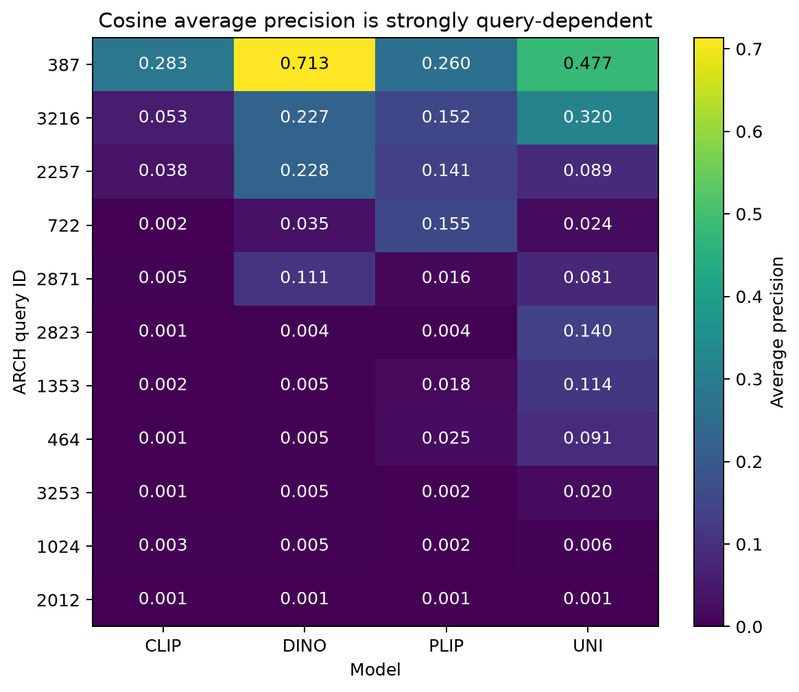
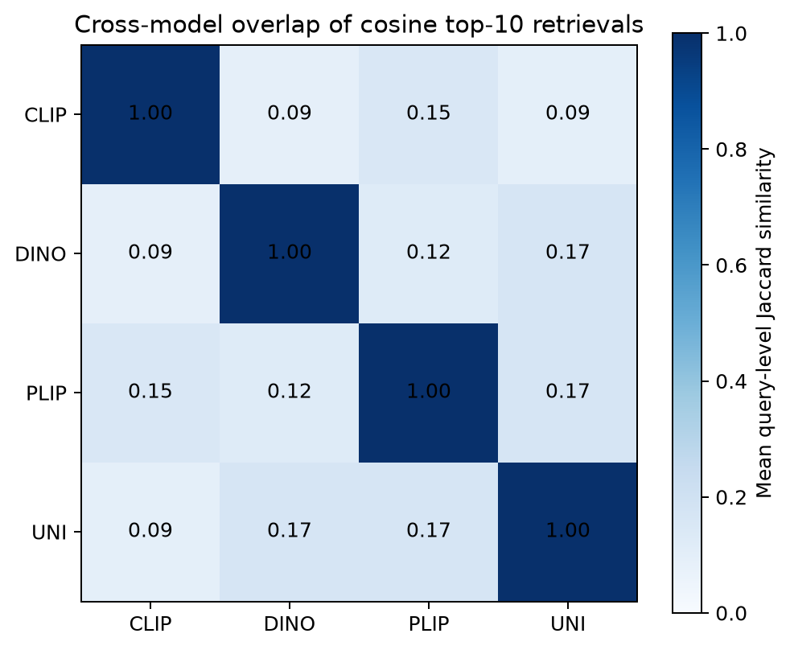
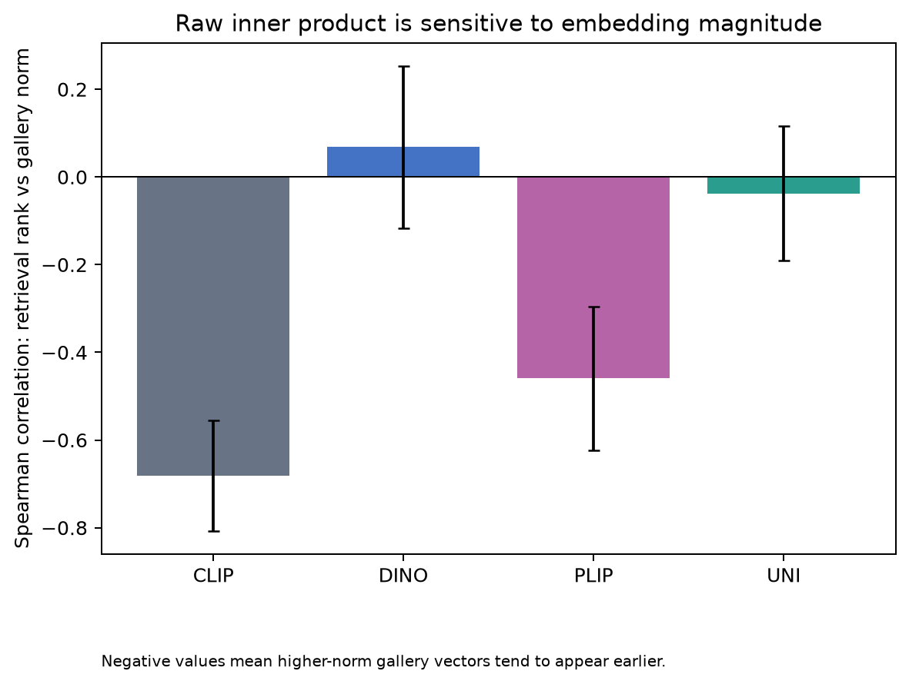
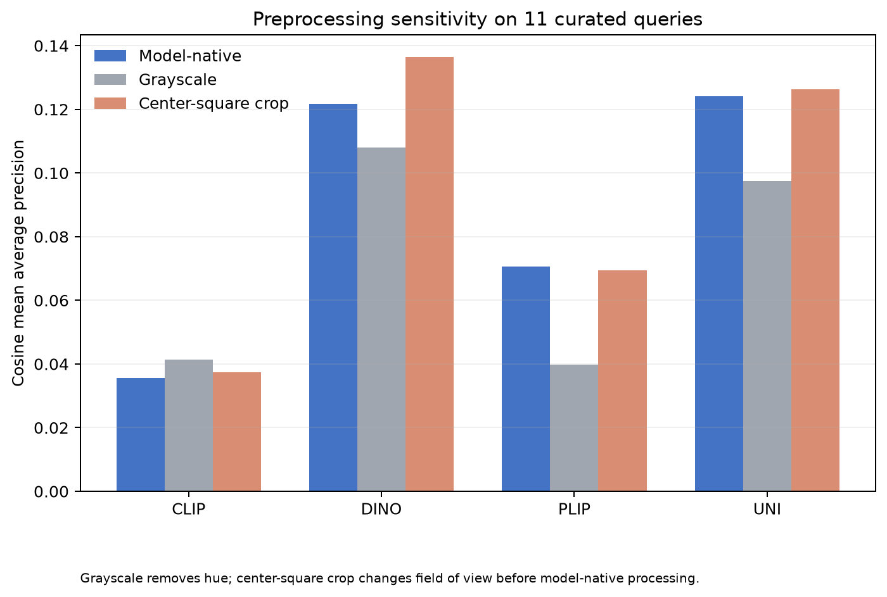

# CIPHER: Biological-Match Retrieval with Pre-trained Histopathology Image Embeddings

**Unofficial retrospective reconstruction — working manuscript, not peer reviewed**

This manuscript describes an independent reconstruction of a Fall 2024 challenge
project. It is not an official Novartis project, Break Through Tech deliverable, or
approved publication. Historical context does not imply endorsement by any advisor,
mentor, teammate, institution, or partner organization. All reconstruction choices,
new analyses, interpretations, errors, and omissions belong to the repository author.

## Abstract

Content-based histopathology image retrieval should return biologically useful
neighbors rather than images that merely share superficial appearance. We evaluate
frozen embeddings from CLIP, DINO, PLIP, and UNI using 11 ARCH PubMed queries, a
3,321-image gallery, and 49 binary pathologist-curated positive matches. CIPHER uses
exact full-gallery ranking, four explicit similarity contracts, deterministic tie
handling, and query-level uncertainty analyses. Under cosine retrieval, UNI and DINO
obtained mean average precision (MAP) of 0.1240 and 0.1218, respectively; their paired
query-bootstrap difference was inconclusive. PLIP obtained 0.0705 and CLIP 0.0356.
Performance was highly query-dependent, and top-10 neighbor overlap between model
pairs was only 0.087–0.168 on average. Raw inner product was strongly associated with
gallery-vector magnitude for CLIP and PLIP and generally reduced MAP. Grayscale and
center-square-crop ablations showed model-specific sensitivity but wide uncertainty.
These results demonstrate heterogeneous embedding behavior, not a definitive model
ranking. The small, positive-only judgment set cannot identify the biological causes
of retrieval or confirm that unjudged images are false matches.

## Background

ARCH was introduced as a multiple-instance captioning dataset containing pathology
images and dense diagnostic and morphological descriptions from textbooks and
articles [1]. CIPHER uses the PubMed portion as an image gallery rather than as a
caption-generation benchmark. The evaluated encoders represent different pretraining
regimes: natural-image language supervision in CLIP [2], self-distillation without
labels in DINO [3], pathology vision-language adaptation in PLIP [4], and large-scale
self-supervised pathology pretraining in UNI [5].

Image retrieval is particularly sensitive to the operational definition of
relevance. Visual similarity may reflect morphology, tissue, stain, magnification,
texture, acquisition artifacts, or figure composition. CIPHER therefore evaluates
against supplied pathologist-curated matches and avoids treating generic proximity as
biological correctness.

## Motivation

The central question is:

> What properties of pre-trained image embedding spaces are associated with correct
> pathologist-curated matches in histopathology retrieval?

The analysis asks whether models rank curated matches differently, whether similarity
metric and normalization alter results, whether models retrieve the same neighbors,
whether raw vector magnitude affects ranking, and whether color or image framing
changes performance.

## Dataset

The prepared manifest contains 3,360 validated image records. After deterministic
exact-duplicate handling, 3,332 active records remain: 11 benchmark queries and 3,321
gallery images. The gallery includes 49 retained curated positives. Query-specific
positive counts range from three to six because the supplied folder contains missing
rank numbers, alternate encodings, repeated labels, and one sixth match. CIPHER uses
observed, adjudicated files only and does not invent missing matches.

Relevance is binary. The filename suffixes `_01`, `_02`, and similar are retained as
provenance, not interpreted as relevance grades. Unjudged gallery images are
operational negatives for metric computation, not confirmed biological negatives.
No patient, slide, specimen, organ, diagnosis, stain, or morphology label is invented
from captions or appearance.

## Models

- **CLIP:** `openai/clip-vit-base-patch32`, 512-dimensional projected image feature.
- **DINO:** original `facebook/dino-vitb16`, 768-dimensional final CLS token.
- **PLIP:** `vinid/plip`, 512-dimensional projected image feature.
- **UNI:** original gated `MahmoodLab/UNI`, 1,024-dimensional final CLS token.

Every checkpoint is pinned to an immutable revision. Models are frozen and evaluated
in float32. Raw and row-wise L2-normalized vectors are stored separately with ordered
image rows and checksums.

## Methods

### Exact retrieval

Every query is compared with every gallery vector. Cosine uses dot product on
L2-normalized vectors. Normalized Euclidean distance is derived from
`sqrt(2 - 2 cosine)` and therefore has exactly the same ranking. Raw inner product
uses unnormalized vectors and ranks descending. Raw Euclidean distance uses
unnormalized vectors and ranks ascending. Exact ties are resolved by ascending image
ID. Query and gallery roles are disjoint, with an additional image-ID self-exclusion
check.

### Evaluation

Per-query metrics include hits, precision, recall, average precision, nDCG, and
first-relevant rank at cutoffs 1, 3, 5, 10, 20, and 50. Full-gallery average
precision and reciprocal rank are macro-averaged into MAP and MRR. AP@k divides by
all known positives for the query, so missed positives remain penalized.

Ten thousand paired query-bootstrap resamples with seed 42 estimate descriptive 95%
intervals for MAP and paired differences. With only 11 queries, these intervals
measure sensitivity to the current query set and are not population-level clinical
confidence intervals.

### Embedding-space diagnostics

Cross-model agreement is the query-level Jaccard similarity between cosine top-k
neighbor sets. Raw embedding norms are summarized by model and role. For each query,
Spearman correlation measures the association between raw-inner-product retrieval
rank and gallery norm. Metric sensitivity compares per-query AP with cosine as the
reference.

### Preprocessing ablations

Two controlled variants precede each checkpoint's native image processor:

1. grayscale conversion replicated into RGB channels, probing dependence on hue and
   stain-color information;
2. centered square cropping using the shorter image dimension, probing field-of-view
   and framing sensitivity.

These transformations are not stain normalization or magnification standardization
and do not isolate a single biological mechanism.

## Retrieval Evaluation

Each reproducible run produces complete rankings, per-query tables, aggregate tables,
checksums, identities, and runtime provenance. Reviewed aggregate results underlying
this manuscript are distributed in `paper/results/`; licensed images, model weights,
and full generated rankings are not redistributed.

## Results

### Baseline retrieval

| Model | Cosine MAP | 95% query-bootstrap interval | MRR | Top-5 accuracy |
|---|---:|---:|---:|---:|
| UNI | 0.1240 | [0.0514, 0.2165] | 0.3154 | 0.5455 |
| DINO | 0.1218 | [0.0247, 0.2605] | 0.2589 | 0.3636 |
| PLIP | 0.0705 | [0.0226, 0.1234] | 0.1143 | 0.3636 |
| CLIP | 0.0356 | [0.0024, 0.0883] | 0.1144 | 0.0909 |


**Figure 1.** Model-native retrieval MAP under cosine, raw inner product, and raw
Euclidean distance. Error bars are descriptive query-bootstrap intervals.

The DINO-minus-UNI cosine AP difference was −0.0023 with a bootstrap interval of
[−0.0603, 0.0646]. Their ordering is therefore unstable with respect to the query
set. CLIP had lower AP than DINO and UNI on all 11 queries. DINO had the highest raw
Euclidean MAP (0.1251), narrowly above UNI (0.1242), while UNI retained higher MRR
and top-5 performance.

### Query heterogeneity and error behavior

Query 387 was much easier than the remainder: mean cosine AP across models was
0.4334, with DINO AP 0.7132. Query 2012 was hardest, with mean AP 0.0011 and no model
retrieving a curated positive in the top five. Queries 1024 and 3253 were also
consistently difficult. UNI's median first-positive rank was 5, but its mean was
82.5, demonstrating long-tailed failures. Corresponding median ranks were 74 for
DINO, 22 for PLIP, and 396 for CLIP.



**Figure 2.** Cosine average precision by query and model, demonstrating strong query
heterogeneity.

### Cross-model agreement

Mean top-10 Jaccard overlap ranged from 0.087 for CLIP–DINO to 0.168 for DINO–UNI.
Thus, models with similar aggregate MAP can reach those scores through substantially
different neighbor sets. PLIP–UNI overlap was 0.165, while CLIP–UNI was 0.091.



**Figure 3.** Mean query-level Jaccard overlap between model top-10 neighbor sets.

### Norm and metric effects

For raw inner product, mean rank-versus-gallery-norm Spearman correlations were
−0.681 for CLIP, −0.459 for PLIP, −0.038 for UNI, and 0.068 for DINO. Negative values
mean higher-norm gallery vectors tend to appear earlier. Relative to cosine, raw
inner product reduced MAP by 0.0105 for CLIP, 0.0074 for DINO, 0.0193 for PLIP, and
0.0057 for UNI. Vector magnitude therefore changes retrieval materially, especially
for CLIP and PLIP, without evidence that the favored magnitude is biologically useful.



**Figure 4.** Association between raw-inner-product retrieval rank and gallery-vector
magnitude. Negative values indicate that high-norm vectors tend to rank earlier.

### Preprocessing sensitivity

| Model | Native MAP | Grayscale MAP | Center-square MAP |
|---|---:|---:|---:|
| CLIP | 0.0356 | 0.0414 | 0.0374 |
| DINO | 0.1218 | 0.1081 | 0.1365 |
| PLIP | 0.0705 | 0.0399 | 0.0695 |
| UNI | 0.1240 | 0.0974 | 0.1263 |

Grayscale lowered PLIP MAP by 0.0307 and UNI MAP by 0.0266, with nine and seven
queries worsened, respectively. However, paired bootstrap intervals for the mean
changes crossed zero. Center-square cropping increased DINO MAP by 0.0147 and UNI by
0.0023, but these intervals also crossed zero. The results suggest model-specific
sensitivity and motivate a larger benchmark; they do not prove reliance on stain or
morphology.



**Figure 5.** Cosine MAP after model-native processing, grayscale conversion, and
center-square cropping.

## Error Analysis

Observed failures fall into four operational categories. First, all models can miss
every curated positive at shallow ranks. Second, aggregate scores conceal large
query-specific reversals: DINO, UNI, and PLIP each lead on at least one query. Third,
models often disagree on unjudged neighbors, making a single-model qualitative panel
an incomplete account. Fourth, raw inner product can promote high-norm images even
when normalized retrieval is better.

The current evidence cannot determine whether these behaviors arise from tissue,
diagnosis, cellular morphology, stain, texture, magnification, panel composition, or
artifacts. CIPHER includes a provenance-aware explanatory annotation schema, but no
annotations are populated without human review.

## Discussion

The most defensible conclusion is not that one encoder wins. UNI and DINO form the
strongest baseline group under normalized retrieval, but their uncertainty overlaps
substantially and they retrieve different images. PLIP's pathology-specific
pretraining does not guarantee superiority on this benchmark, while general CLIP is
consistently weak. These outcomes are compatible with retrieval depending on both
pretraining regime and query content.

Normalization is a scientifically consequential choice rather than a cosmetic
implementation detail. The strong norm association for CLIP and PLIP, coupled with
lower raw-inner-product MAP, indicates that magnitude can dominate neighbor ordering
without improving curated relevance. Controlled color and crop transformations also
change model behavior, but 11 queries are insufficient to attribute the changes.

## Limitations

The benchmark has only 11 queries and 49 positive judgments. Positives were curated
for a basic benchmark rather than exhaustive relevance assessment. Unjudged items may
include biologically valid matches, so precision-like metrics underestimate relevance
when unjudged positives are retrieved. There are no graded relevance judgments,
patient identifiers, slide identifiers, or specimen groups. Captions are not
validated structured labels and may describe multi-panel figures imperfectly.

Bootstrap intervals assume the 11 observed queries are the resampling units; they do
not solve selection bias or establish external validity. No multiple-comparison claim
is made. The grayscale ablation removes all hue rather than applying pathology stain
normalization. Center-square cropping changes composition and field of view
simultaneously. Model-native resizing may alter effective magnification differently
across encoders. No new qualitative retrieval interpretation has been adjudicated by
a pathologist. The code is a research tool, not a medical device.

## Future Work

The highest-priority extension is expert annotation of retrieved and curated images
for tissue, stain, morphology, magnification, artifact, and panel composition, with
annotator provenance and adjudication. A larger query set should include exhaustive
or pooled judgments from multiple models. Future analyses should add stain
normalization, magnification-aware sampling, crop-policy experiments, confidence
intervals designed for the expanded sampling scheme, and external datasets with
patient-aware grouping. Cross-model consensus may be useful as a review signal but
should not be treated as relevance without expert judgment.

## Reproducibility statement

CIPHER pins model revisions, records source and manifest hashes, stores ordered image
identities, and writes raw and normalized float32 embeddings into content-addressed,
checksum-verified artifacts. Exact retrieval retains every gallery rank. Configuration
files define metric contracts and cutoffs. The baseline and ablations can be rebuilt
by following the terminal workflow. Each command prints the content-addressed ID
required by the next command:

```bash
cipher embeddings assemble --models clip,dino,plip,uni --role all
EMBEDDING_SET_ID="<set-id printed above>"
cipher evaluate benchmark --embedding-set "$EMBEDDING_SET_ID"

BENCHMARK_ID="<benchmark-id printed above>"
cipher analysis run --benchmark-id "$BENCHMARK_ID"

ANALYSIS_ID="<analysis-id printed above>"
cipher make-figures --analysis-id "$ANALYSIS_ID" \
  --benchmark-id "$BENCHMARK_ID"
```

Licensed datasets, curated images, generated embeddings, model weights, and reports
are excluded from Git. UNI access remains subject to its provider's terms. Original
CIPHER code and documentation are MIT licensed; that license does not cover external
assets.

## References

1. Gamper J, Rajpoot N. [Multiple Instance Captioning: Learning Representations From
   Histopathology Textbooks and Articles](https://openaccess.thecvf.com/content/CVPR2021/html/Gamper_Multiple_Instance_Captioning_Learning_Representations_From_Histopathology_Textbooks_and_Articles_CVPR_2021_paper.html).
   CVPR. 2021:16549–16559.
2. Radford A, et al. [Learning Transferable Visual Models From Natural Language
   Supervision](https://arxiv.org/abs/2103.00020). 2021.
3. Caron M, et al. [Emerging Properties in Self-Supervised Vision
   Transformers](https://arxiv.org/abs/2104.14294). ICCV. 2021.
4. Huang Z, et al. [A visual–language foundation model for pathology image analysis
   using medical Twitter](https://www.nature.com/articles/s41591-023-02504-3).
   Nature Medicine. 2023;29:2307–2316.
5. Chen RJ, et al. [Towards a general-purpose foundation model for computational
   pathology](https://www.nature.com/articles/s41591-024-02857-3). Nature Medicine.
   2024;30:850–862.
